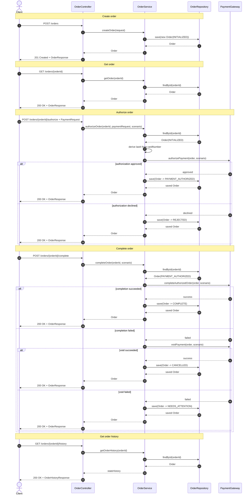

# Order Service Sequence Diagram

This Mermaid diagram is aligned with the current implementation in the repository.

```mermaid
sequenceDiagram
    autonumber
    actor Client
    participant Controller as OrderController
    participant Service as OrderService
    participant Repo as OrderRepository
    participant Gateway as PaymentGateway

    Note over Client,Repo: Create order
    Client->>Controller: POST /orders
    Controller->>Service: createOrder(request)
    Service->>Repo: save(new Order(INITIALIZED))
    Repo-->>Service: Order
    Service-->>Controller: Order
    Controller-->>Client: 201 Created + OrderResponse

    Note over Client,Repo: Get order
    Client->>Controller: GET /orders/{orderId}
    Controller->>Service: getOrder(orderId)
    Service->>Repo: findById(orderId)
    Repo-->>Service: Order
    Service-->>Controller: Order
    Controller-->>Client: 200 OK + OrderResponse

    Note over Client,Gateway: Authorize order
    Client->>Controller: POST /orders/{orderId}/authorize + PaymentRequest
    Controller->>Service: authorizeOrder(orderId, paymentRequest, scenario)
    Service->>Repo: findById(orderId)
    Repo-->>Service: Order(INITIALIZED)
    Service->>Service: derive last4 from cardNumber
    Service->>Gateway: authorizePayment(order, scenario)

    alt authorization approved
        Gateway-->>Service: approved
        Service->>Repo: save(Order -> PAYMENT_AUTHORIZED)
        Repo-->>Service: saved Order
        Service-->>Controller: Order
        Controller-->>Client: 200 OK + OrderResponse
    else authorization declined
        Gateway-->>Service: declined
        Service->>Repo: save(Order -> REJECTED)
        Repo-->>Service: saved Order
        Service-->>Controller: Order
        Controller-->>Client: 200 OK + OrderResponse
    end

    Note over Client,Gateway: Complete order
    Client->>Controller: POST /orders/{orderId}/complete
    Controller->>Service: completeOrder(orderId, scenario)
    Service->>Repo: findById(orderId)
    Repo-->>Service: Order(PAYMENT_AUTHORIZED)
    Service->>Gateway: completeAuthorizedOrder(order, scenario)

    alt completion succeeded
        Gateway-->>Service: success
        Service->>Repo: save(Order -> COMPLETE)
        Repo-->>Service: saved Order
        Service-->>Controller: Order
        Controller-->>Client: 200 OK + OrderResponse
    else completion failed
        Gateway-->>Service: failed
        Service->>Gateway: voidPayment(order, scenario)

        alt void succeeded
            Gateway-->>Service: success
            Service->>Repo: save(Order -> CANCELLED)
            Repo-->>Service: saved Order
            Service-->>Controller: Order
            Controller-->>Client: 200 OK + OrderResponse
        else void failed
            Gateway-->>Service: failed
            Service->>Repo: save(Order -> NEEDS_ATTENTION)
            Repo-->>Service: saved Order
            Service-->>Controller: Order
            Controller-->>Client: 200 OK + OrderResponse
        end
    end

    Note over Client,Repo: Get order history
    Client->>Controller: GET /orders/{orderId}/history
    Controller->>Service: getOrderHistory(orderId)
    Service->>Repo: findById(orderId)
    Repo-->>Service: Order
    Service-->>Controller: stateHistory
    Controller-->>Client: 200 OK + OrderHistoryResponse
```
